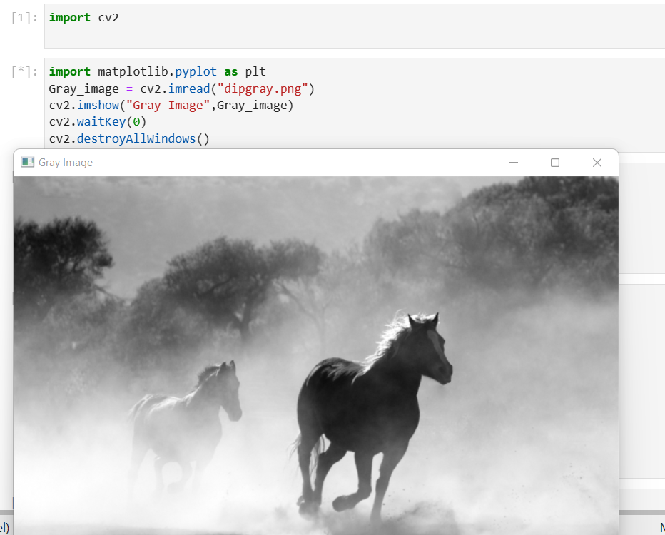
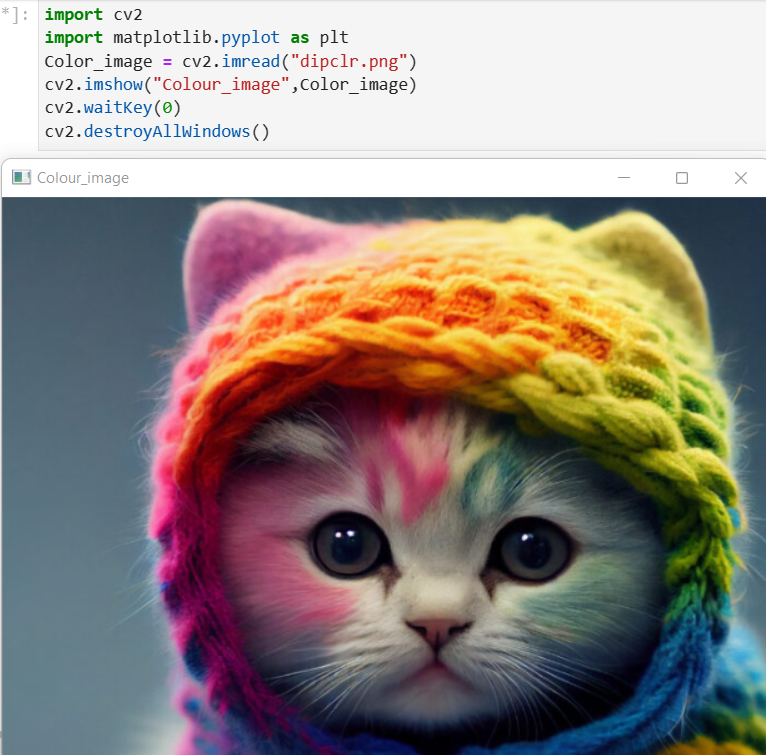
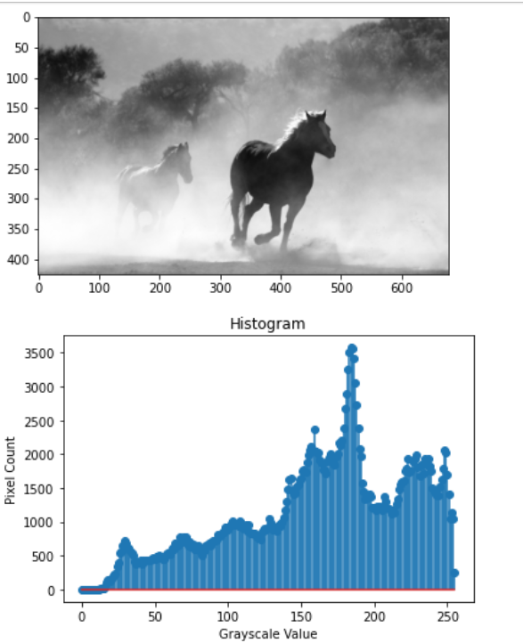
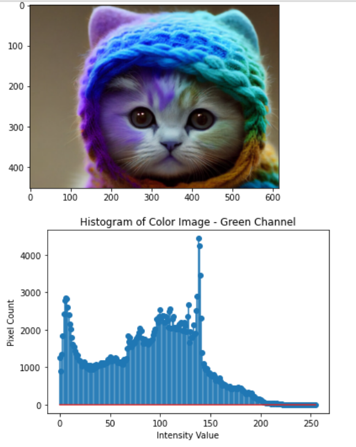
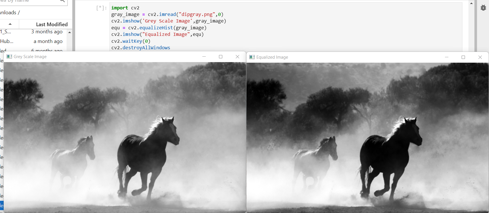

# Histogram and Histogram Equalization of an image
## Aim
To obtain a histogram for finding the frequency of pixels in an Image with pixel values ranging from 0 to 255. Also write the code using OpenCV to perform histogram equalization.

## Software Required:
Anaconda - Python 3.7

## Algorithm:
### Step1:
Import the libraries.

### Step2:
Use cv2.calcHist to find the histogram of the image.

### Step3:
Plot the image and its stem plots using the functions.

### Step4:
Equalize the grayscale image using the in-built function cv2.equalizeHist().

### Step5:
Display the original and equalized image.

## Program:
```
Developed By: M.Sowmya
Register Number:212221230107
```

### Code to find the histogram of gray scale image and color image channels:
```
import cv2
import matplotlib.pyplot as plt
Gray_image = cv2.imread("dipgray.png")
cv2.imshow("Gray Image",Gray_image)
cv2.waitKey(0)
cv2.destroyAllWindows()

import cv2
import matplotlib.pyplot as plt
Color_image = cv2.imread("dipclr.png")
cv2.imshow("Colour_image",Color_image)
cv2.waitKey(0)
cv2.destroyAllWindows()
```

### Display the histogram of gray scale image and any one channel histogram from color image:
```
import numpy as np
import cv2
Gray_image = cv2.imread("dipgray.png")
Color_image = cv2.imread("dipclr.png")
import matplotlib.pyplot as plt
gray_hist = cv2.calcHist([Gray_image],[0],None,[256],[0,256])
color_hist = cv2.calcHist([Color_image],[0],None,[256],[0,256])
plt.figure()
plt.imshow(Gray_image)
plt.show()
plt.title("Histogram")
plt.xlabel("Grayscale Value")
plt.ylabel("Pixel Count")
plt.stem(gray_hist)
plt.show()
plt.imshow(Color_image)
plt.show()
plt.title("Histogram of Color Image - Green Channel")
plt.xlabel("Intensity Value")
plt.ylabel("Pixel Count")
plt.stem(color_hist)
plt.show()
cv2.waitKey(0)
cv2.destroyAllWindows()
```

### The code to perform histogram equalization of the image:
```
import cv2
gray_image = cv2.imread("dipgray.png",0)
cv2.imshow('Grey Scale Image',gray_image)
equ = cv2.equalizeHist(gray_image)
cv2.imshow("Equalized Image",equ)
cv2.waitKey(0)
cv2.destroyAllWindows  
```
## Output:
### Input Grayscale Image and Color Image:




### Histogram of Grayscale Image and any channel of Color Image:



### Histogram Equalization of Grayscale Image:


## Result: 
Thus the histogram for finding the frequency of pixels in an image with pixel values ranging from 0 to 255 is obtained. Also,histogram equalization is done for the gray scale image using OpenCV.
